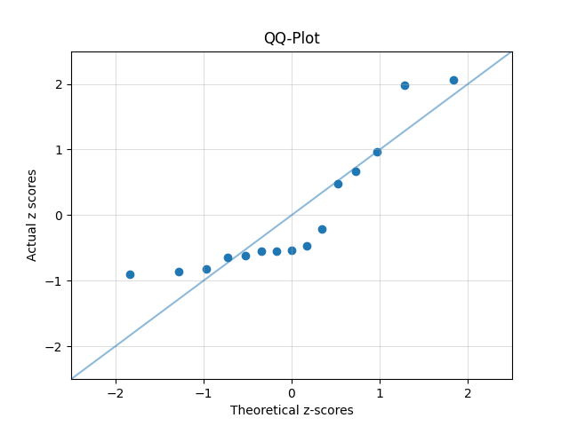
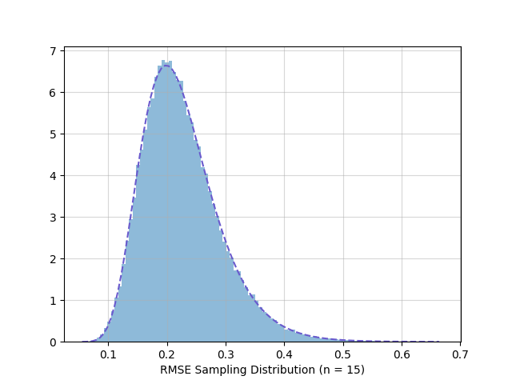

# RMSE Normality Test

This is an implementation of a formal statistical test that can be used to augment the QQ-plot as a test for normality. The test is based on the sampling distribution of the RMSE statistic associated with the QQ-plot if we treat the theoretical z-scores we would expect under the assumption that the population a sample is drawn from is normally distributed as *predictions* for the actual z-scores obtained by mapping each value in the sample to the number of standard deviations it lies from the mean.

For an overview of the project, see [this video presentation](https://youtu.be/kQ64O7N9kSA?si=eAhRrcPQdi-m_MaO); for further details, see [the paper](docs/RMSE%20Normality%20Test.pdf) this library was developed in conjunction with.

## Install

Install directly from this repository using:

```text
pip install git+https://github.com/ram6ler/RMSE-Normality-Test
```

## Example: Performing the RMSE Test on a Sample

Let's create a test for a sample drawn from a population with an unknown distribution.

```py
from rmse_test import RMSETest

sample = [
    1.09, 1.17, 1.26, 1.66, 1.72,
    1.88, 1.89, 1.90, 2.05, 2.64,
    4.21, 4.62, 5.31, 7.59, 7.77,
]

test = RMSETest(sample)
```

Let's see a summary of the sample data:

```py
print(test)
```

```txt
Key:
  x: sorted sample data                           
 tz: expected z-scores under normality hypothesis 
  z: actual sample z-scores                       
  e: errors in predicting z with tz   

Data:
.----------.----------.----------.----------.
|    x     |    tz    |    z     |    e     |
:----------:----------:----------:----------:
|   1.09   |  -1.834  |  -0.899  |  -0.935  |
|   1.17   |  -1.282  |  -0.863  |  -0.418  |
|   1.26   |  -0.967  |  -0.823  |  -0.144  |
|   1.66   |  -0.728  |  -0.646  |  -0.082  |
|   1.72   |  -0.524  |  -0.620  |   0.095  |
|   1.88   |  -0.341  |  -0.549  |   0.208  |
|   1.89   |  -0.168  |  -0.544  |   0.376  |
|   1.90   |   0.000  |  -0.540  |   0.540  |
|   2.05   |   0.168  |  -0.473  |   0.641  |
|   2.64   |   0.341  |  -0.212  |   0.552  |
|   4.21   |   0.524  |   0.484  |   0.040  |
|   4.62   |   0.728  |   0.666  |   0.062  |
|   5.31   |   0.967  |   0.972  |  -0.005  |
|   7.59   |   1.282  |   1.983  |  -0.701  |
|   7.77   |   1.834  |   2.063  |  -0.229  |
'----------'----------'----------'----------'

Results:
    n: 15
 RMSE: 0.449
    p: 0.006
```

We could use the test object data to plot the associated QQ-plot; for example:

```py
import matplotlib.pyplot as plt

plt.xlim(-2.5, 2.5)
plt.ylim(-2.5, 2.5)
plt.plot([-2.5, 2.5], [-2.5, 2.5], alpha=0.5)
plt.grid(alpha=0.4)
plt.title("QQ-Plot")
plt.xlabel("Theoretical z-scores")
plt.ylabel("Actual z scores")
plt.scatter(test.theoretical_z_scores, test.z_scores)
plt.show()
```



What is the RMSE statistic associated with this QQ-plot?

```py
print(f"RMSE Statistic: {test.rmse}")
```

```txt
RMSE Statistic: 0.4494143469898124
```

What is the 5% significance critical RMSE statistic value for a sample of this size?

```py
print(f"Critical 5% RMSE: {test.critical_rmse(0.05)}")
```

```txt
Critical 5% RMSE: 0.34831873897411836
```

What is the p-value associated with the RMSE statistic of this sample?

```py
print(f"P-Value: {test.p_value}")
```

```txt
P-Value: 0.0057584819560067
```

Conclusion: At a 5% significance level (or even a 1% significance level), we have sufficient evidence to reject the hypothesis that this sample was drawn from a normally distributed population.

## Example: Estimating the Power of the RMSE in a Given Context

What is an estimate of the statistical power of the RMSE test for a sample of size 15 drawn from a log-normal population with parameters $\mu=0$ and $\sigma=1$, and using a significance level of 5%?

```python
from rmse_test import Populations
from rmse_test.explore import rmse_power_estimate

Populations.seed(0)

print(
    rmse_power_estimate(
        sample_size=15,
        population=Populations.LOG_NORMAL(0.0, 1.0),
        experiments=100_000,
        significance_level=0.05,
    )
)
```

(That's a lot of experiments; wait a while...)

```txt
0.8049
```

Conclusion: The RMSE test has a statistical power of around 80% to discriminate against this log-normal population.


## Example: Developing a Model for Simulated RMSE Statistics

It turns out that the sampling distribution of the RMSE statistic is well modeled as a log-normal distribution, as shown in this example session.

```python
from math import exp
from typing import Callable

# Using the log-normal distribution from scipy.
from scipy.stats import lognorm
import matplotlib.pyplot as plt

from rmse_test import Populations
from rmse_test.explore import monte_carlo_simulations, log_normal_fit

# Get the pdf from scipy.
def log_norm_pdf(
    mu: float,
    sigma: float,
) -> Callable[[float], float]:
    return lognorm(s=sigma, scale=exp(mu)).pdf

sample_size = 15
simulations = 100_000

Populations.seed(0)

simulated_rmse_values = sorted(
    monte_carlo_simulations(
        sample_size,
        simulations,
    )
)

# Fit a log-normal model to the simulated RMSE values.
mu, sigma = log_normal_fit(simulated_rmse_values)
print(f"μ = {mu:.3f}; σ = {sigma:.3f}")
```
```text
μ = -1.531; σ = 0.289
```
```python
# Get model pdf.
pdf = log_norm_pdf(mu, sigma)

x_start = simulated_rmse_values[0]
x_end = simulated_rmse_values[-1]
points = 100
xs = [x_start + (x_end - x_start) * i / points for i in range(points)]
ys = [pdf(x) for x in xs]

plt.hist(
    simulated_rmse_values,
    density=True,
    bins=100,
    alpha=0.5,
)

plt.plot(xs, ys, "--", color="slateblue")
plt.grid(alpha=0.5)
plt.xlabel("RMSE Sampling Distribution (n = 15)")
plt.show()
```



## Issues

Thanks for your interest! Please [submit any issues or requests here](https://github.com/ram6ler/RMSE-Normality-Test/issues).